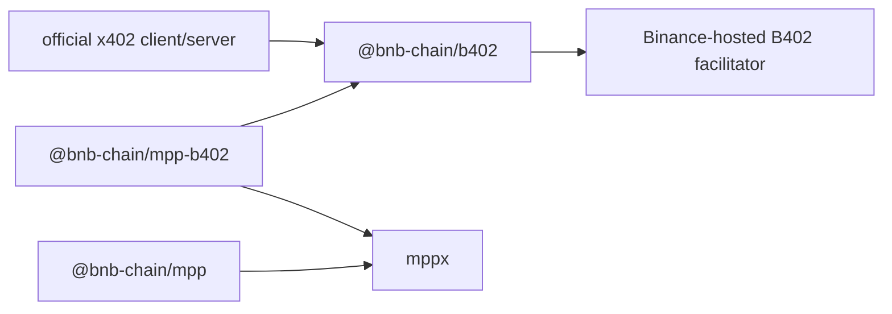
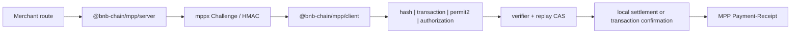
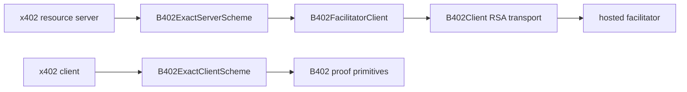

# Architecture

This workspace publishes three packages with one-way dependencies.

| Module                | Responsibility                                                                  |
| --------------------- | ------------------------------------------------------------------------------- |
| `@bnb-chain/mpp`      | Generic `evm/charge` Method, four credentials, replay and settlement machinery. |
| `@bnb-chain/b402`     | B402 Provider Module and official x402 client/server Adapters.                  |
| `@bnb-chain/mpp-b402` | Thin MPP `b402/charge` Adapter backed by `@bnb-chain/b402`.                     |

`@bnb-chain/mpp` has no B402 imports. `@bnb-chain/b402` has no MPP or mppx
imports. This makes the Provider Interface the real Seam: the official x402 SDK
and the MPP Method are two independent Adapters.

## Generic EVM Charge

`src/Methods.ts` remains the single wire contract for `evm/charge`.

The replay store and Challenge store remain separate. See
[replay-store.md](replay-store.md).

## B402 Provider Module

`packages/b402` owns the behavior that must be identical for every caller:

- B402 EIP-3009 and Permit2 Exact typed data;
- Tesla RSA transport for `/supported`, `/verify`, and `/settle`;
- TTL/single-flight supported snapshot caching;
- runtime response parsing and payer/amount/network/transaction checks;
- unknown-settlement classification;
- official x402 `FacilitatorClient`, `SchemeNetworkClient`, and
  `SchemeNetworkServer` Implementations.

The Module is deep: callers learn one Provider Interface while its
Implementation retains the signing, trust and settlement invariants. Deleting
it would duplicate those invariants in both x402 and MPP, so the split improves
both Leverage and Locality.

The official x402 SDK owns HTTP headers, retry and resource lifecycle. This
workspace does not restore a custom Gate or buyer fetch loop.

## MPP B402 Adapter

`packages/mpp-b402/src/Methods.ts` is the single MPP wire contract for
`b402/charge`. Both transfer methods bind their nonce to the MPP Challenge.

The MPP Adapter owns Challenge binding, Credential serialization and Receipt
mapping. It delegates Provider proof validation, snapshots and settlement
classification to `@bnb-chain/b402`.

## Trust and settlement

The merchant owns amount, asset, network, payout, enabled transfer method and
optional Bazaar metadata. `/supported` owns the current signer/proxy snapshot.
The buyer never treats an HTTP-provided Permit2 spender as a trust root;
`trustedSpenders` is mandatory for Permit2 Exact.

Buyer `accepted`, resource and extensions are not forwarded verbatim. The
Provider Module reconstructs requests from merchant requirements and signed
proof fields. Bazaar metadata is injected only from merchant configuration.

After `/settle` begins, transport/parser failures, malformed successes, and
failed responses carrying transaction evidence are unknown outcomes. The
typed callback is a Seam into the merchant's durable workflow; this workspace
does not own order storage or reconciliation policy.

See [ADR-0006](adr/0006-b402-package-split.md) and [b402.md](b402.md).
