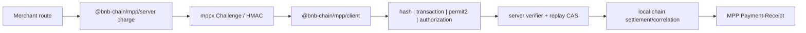
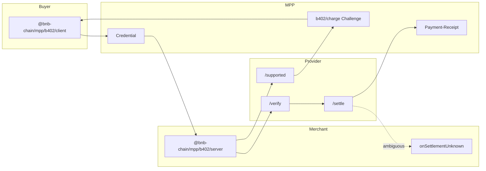

# Architecture

`@bnb-chain/mpp` is a collection of MPP payment methods and provider
extensions built on `mppx`.

## Public Modules

| Module                       | Responsibility                                                                         |
| ---------------------------- | -------------------------------------------------------------------------------------- |
| `@bnb-chain/mpp`             | Shared EVM Charge Method, amount helper, and EVM receipt codec.                        |
| `@bnb-chain/mpp/client`      | Four `evm/charge` credential Implementations and high-level `pay()`.                   |
| `@bnb-chain/mpp/server`      | EVM Charge factory, local/on-chain verifiers, replay protection, and settlement Seams. |
| `@bnb-chain/mpp/b402`        | Shared `b402/charge` contract and browser-safe B402 primitives.                        |
| `@bnb-chain/mpp/b402/client` | B402 wallet Implementation for EIP-3009 and Permit2 Exact.                             |
| `@bnb-chain/mpp/b402/server` | B402 merchant Method, authenticated provider client, and EIP-3009 facilitator Adapter. |

The generic EVM Module and the B402 provider Module are peers. Adding B402
does not replace or weaken the original EVM Charge functionality.

## Generic EVM Charge

`src/Methods.ts` is the single wire contract for `evm/charge`. Server and
client import the same Method instance.

The replay store is independent of Challenge storage. HMAC Challenge binding
does not remove the requirement for a durable atomic replay store in
production. See [replay-store.md](replay-store.md).

## B402 provider extension

`src/b402/Methods.ts` is the single wire contract for the MPP-native
`b402/charge` method. It exposes two transfer methods under one MPP lifecycle:

- `eip3009`;
- `permit2-exact`.

The Module is deliberately deep: callers configure a wallet or merchant
client once, while the Implementation hides provider snapshot resolution,
Challenge nonce binding, payload reconstruction, local signature recovery,
runtime response parsing, and settlement classification.

### Trust boundary

The merchant configuration owns amount, token, network, recipient, token
domain, optional Bazaar metadata, and enabled transfer methods. `/supported`
owns only the current B402 signer/proxy snapshot. Both sets of values are
bound into the Challenge.

The merchant Method factory is asynchronous: it resolves and validates an
initial snapshot before route construction, satisfying mppx's synchronous
canonical-route requirement. Fresh Challenges use the TTL cache; a paid retry
reuses the snapshot already bound into its original Challenge.

The server never forwards a buyer-supplied `accepted`, resource, or extension
object. It creates a new provider request from the verified Challenge and
credential proof. Permit2 buyers must also provide a `trustedSpenders`
allowlist; an HTTP Challenge is not a trust root.

### Settlement state

The shared settlement Implementation accepts a success only when transaction
hash, amount, network, and payer match the expected payment. A transport/parser
failure after `/settle` starts, or a malformed success, raises
`B402SettlementUnknownError` and calls `onSettlementUnknown`.

The SDK does not contain an order table or reconciliation store. The callback
is the Seam into the merchant's existing durable workflow. Persisting its
signed request is optional; when chosen, the host must protect it as sensitive
data until the authorization expires.

The success Receipt carries method-specific `challengeId`, `network`, `payer`,
and `transferMethod` fields (plus configured `externalId`). They give the host
stable reconciliation inputs, but paid-content/order fulfillment idempotency
remains an application responsibility.

### Standard facilitator compatibility

`createB402Facilitator()` implements the standard `mppx` x402 facilitator
Interface for EIP-3009. This lets an existing `evm/charge` Integration use
B402 without adopting the provider-specific method.

B402 Permit2 Exact is not representable by that Interface and stays on
`b402/charge`. No translation is attempted between incompatible witnesses.

## Provider locality

B402 code stays below `src/b402/`. A later provider should initially use its
own `/provider`, `/provider/client`, and `/provider/server` Modules. A generic
provider abstraction should be extracted only after a second Implementation
proves a stable shared Seam; this avoids coupling provider-specific signing,
trust, and settlement semantics prematurely.

The decision is recorded in
[ADR-0005](adr/0005-b402-provider-extension.md). The complete integration
guide is [b402.md](b402.md).
